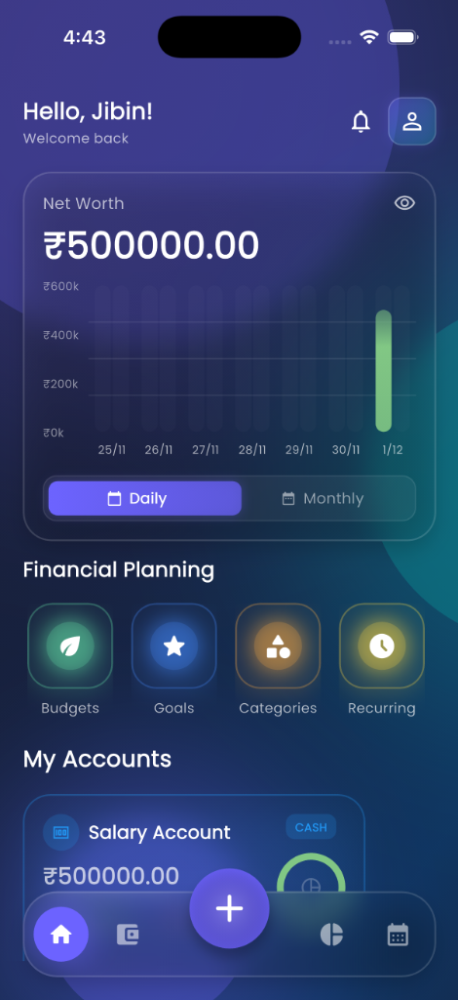

# CashFlow
## Personal Finance Management
### Simplified. Secure. Smart.

---

## The Problem

- **Financial Disorganization**: Tracking multiple accounts is chaotic.
- **Lack of Insight**: Hard to know where money is going.
- **Privacy Concerns**: Cloud-based apps often compromise data privacy.

---

## The Solution: CashFlow

**CashFlow** is a modern, privacy-focused mobile application designed to bring clarity to your finances.

- **Centralized Dashboard**: All accounts in one place.
- **Visual Analytics**: Understand spending at a glance.
- **Local-First Security**: Your data stays on your device.

---

## Key Features

- **Transaction Tracking**: Easy income & expense entry.
- **Budgeting & Goals**: Plan for the future.
- **Multi-Currency**: Global support.
- **Secure**: App Lock & Biometrics.

---

## Visual Tour: Dashboard

*Real-time overview of your net worth.*

---

## Visual Tour: Analytics

*Interactive charts to track trends.*

---

## Visual Tour: Reports

*Professional PDF reports for sharing and printing.*

---

## Technical Highlights

- **Built with Flutter**: High-performance, cross-platform.
- **Glassmorphism UI**: Modern, premium aesthetic.
- **Secure Storage**: Industry-standard encryption.
- **Offline Capable**: No internet required for core features.

---

## Roadmap

- **Q1 2026**: Cloud Sync (Optional).
- **Q2 2026**: AI-Powered Insights.
- **Q3 2026**: Investment Portfolio Tracking.

---

## Thank You!

**Download CashFlow Today**
*Take control of your financial future.*
