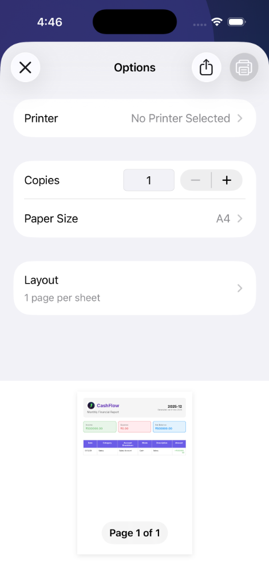

# CashFlow App - Technical Project Documentation

**Version:** 1.0.0  
**Platform:** Flutter (Cross-platform)  
**Database:** SQLite (Sqflite)  
**State Management:** Provider Pattern  
**Date:** November 2025

---

## Table of Contents

1. [Project Overview](#project-overview)
2. [Features & Functionality](#features--functionality)
3. [System Architecture](#system-architecture)
4. [Database Design](#database-design)
5. [Security Implementation](#security-implementation)
6. [Feature Implementation Logic](#feature-implementation-logic)
7. [Technology Stack](#technology-stack)
8. [Code Structure](#code-structure)
9. [Testing Strategy](#testing-strategy)
10. [Future Enhancements](#future-enhancements)

---

## 1. Project Overview

### 1.1 Purpose
CashFlow is a comprehensive personal finance management application designed to help users track their income, expenses, and overall financial health. The application provides real-time insights, budgeting tools, goal tracking, and detailed financial reports.

### 1.2 Target Audience
- Individuals seeking to manage personal finances
- Users wanting to track multiple accounts (bank, cash, credit cards, loans)
- People interested in budget planning and financial goal setting
- Users requiring detailed financial reports and analytics

### 1.3 Key Objectives
- Provide intuitive financial tracking
- Enable multi-account management
- Offer visual analytics and insights
- Support budget and goal planning
- Generate comprehensive financial reports
- Ensure data privacy and security

---

## 2. Features & Functionality

### 2.1 Authentication & User Management

#### **User Registration**
- **Description:** Secure user account creation with personal information
- **Fields:** First Name, Last Name, Username, Password, Currency Preference
- **Validation:** Username uniqueness check, password strength requirements
- **Implementation:** Hashed password storage (basic implementation), UUID-based user IDs

#### **User Login**
- **Description:** Secure authentication system
- **Features:** 
  - Username/password authentication
  - Auto-login on app restart using SharedPreferences
  - Session management
- **Security:** Credentials validated against encrypted database

#### **Profile Management**
- **Description:** User profile editing and customization
- **Editable Fields:** First Name, Last Name, Password, Currency Symbol
- **Additional Features:** 
  - Data reset functionality
  - Logout capability
  - Account deletion

#### **Security Settings**
- **Description:** Enhanced app security
- **Features:**
  - **App Lock:** Secure app with 4-digit PIN
  - **Biometrics:** FaceID/Fingerprint unlock support
  - **Auto-Lock:** Immediate lock when app goes to background
  - **Privacy:** Content hidden in recent apps view


### 2.2 Account Management

#### **Multi-Account Support**
The application supports various account types:

1. **Cash Account**
   - Simple balance tracking
   - No additional fields required

2. **Savings Account**
   - Bank name
   - Account number
   - Balance tracking

3. **Salary Account**
   - Bank name
   - Account number
   - Income tracking

4. **Current Account**
   - Bank name
   - Account number
   - Business transaction tracking

5. **Credit Card**
   - Bank name
   - Card number (last 4 digits)
   - Credit limit tracking
   - Outstanding balance

6. **Investment Account**
   - Investment type
   - Current value
   - Returns tracking

7. **Loan Account**
   - **Loan Principal:** Original loan amount
   - **Interest Rate:** Annual interest rate
   - **Tenure:** Loan duration in months
   - **EMI Amount:** Monthly installment
   - **EMI Payment Day:** Day of month for payment
   - **EMIs Paid:** Track payment progress
   - **Computed Fields:**
     - Remaining EMIs
     - Remaining loan balance
     - Total interest paid

#### **Account Features**
- Color-coded accounts for easy identification
- Custom icons for visual distinction
- Real-time balance updates
- Account-wise transaction filtering
- Edit and delete capabilities


### 2.3 Transaction Management

#### **Transaction Recording**
- **Types:** Income and Expense
- **Fields:**
  - Title/Description
  - Amount
  - Date
  - Category
  - Account association
  - Tags (multiple)
- **Categories:**
  - **Income:** Salary, Business, Investments, Gifts, Other
  - **Expense:** Food, Transport, Shopping, Bills, Entertainment, Health, Education, Other

#### **Transaction Features**
- Multi-step transaction entry form
- Account selection with visual cards
- Category-based organization
- Tag-based filtering
- Date-based filtering
- Search functionality
- Edit and delete capabilities
- Bulk operations


#### **Recurring Transactions**
- **Description:** Automate regular income/expenses
- **Frequency Options:** Daily, Weekly, Monthly, Yearly
- **Features:**
  - Auto-add to transactions
  - Next due date tracking
  - Category assignment
  - Account linking
  - Edit and delete capabilities

### 2.4 Budget Management

#### **Budget Creation**
- **Description:** Set spending limits by category
- **Fields:**
  - Category
  - Budget amount
  - Period (Monthly/Yearly)
  - Start date
- **Features:**
  - Category-wise budget allocation
  - Period-based tracking
  - Budget vs. actual comparison
  - Visual progress indicators
  - Overspending alerts

#### **Budget Tracking**
- Real-time expense tracking against budgets
- Visual progress bars
- Percentage calculations
- Warning indicators for overspending
- Historical budget performance


### 2.5 Financial Goals

#### **Goal Setting**
- **Description:** Define and track financial objectives
- **Fields:**
  - Goal name
  - Target amount
  - Current amount
  - Deadline
  - Custom icon and color
- **Features:**
  - Progress tracking
  - Visual progress indicators
  - Deadline reminders
  - Manual contribution updates
  - Goal achievement notifications

#### **Goal Management**
- Add/Edit/Delete goals
- Track multiple goals simultaneously
- Visual progress representation
- Completion percentage calculation
- Time remaining display


### 2.6 Analytics & Insights

#### **Dashboard**
- **Net Worth Display:**
  - Total balance across all accounts
  - Daily/Weekly/Monthly/Yearly view toggle
  - Bar chart visualization
  - Hide/show functionality for privacy

- **Income vs. Expense Analysis:**
  - Current month comparison
  - Visual pie chart
  - Percentage breakdown
  - Trend indicators

- **Recent Transactions:**
  - Last 5 transactions
  - Quick view with amount and category
  - Account information
  - Navigation to full transaction list

- **Quick Access Cards:**
  - Accounts overview
  - Statistics
  - Monthly reports
  - Goals
  - Budgets
  - Recurring transactions
  - Calendar view
  - Insights

#### **Statistics Screen**
- **Account-wise Breakdown:**
  - Income and expense per account
  - Line charts for trends
  - Category distribution
  - Time-based filtering

- **Financial Trends:**
  - Line chart visualization
  - Monthly income/expense trends
  - Comparative analysis
  - Customizable date ranges

- **Category Analysis:**
  - Pie chart for expense distribution
  - Top spending categories
  - Category-wise totals
  - Percentage calculations


#### **Monthly Reports**
- **Report Generation:**
  - Month-wise financial summary
  - Total income and expenses
  - Category breakdown
  - Transaction list
  - Account-wise analysis

- **PDF Export:**
  - Professional report layout
  - App branding (logo and name)
  - Summary cards
  - Category breakdown with charts
  - Detailed transaction table
  - Share functionality





### 2.7 Calendar View

#### **Transaction Calendar**
- **Description:** Visual calendar showing transactions
- **Features:**
  - Month view with transaction markers
  - Day-wise transaction list
  - Income/expense indicators
  - Quick transaction entry
  - Date-based filtering

### 2.8 Tags Management

#### **Tag System**
- **Description:** Organize transactions with custom tags
- **Features:**
  - Create custom tags
  - Color-coded tags
  - Multiple tags per transaction
  - Tag-based filtering
  - Tag management screen

### 2.9 Notifications

#### **Notification Types**
1. **EMI Reminders:**
   - Scheduled 2 days before due date
   - Loan account specific
   - Amount and date details
   - Auto-scheduling on loan creation

2. **Budget Alerts:**
   - Overspending notifications
   - Budget threshold warnings

3. **Goal Reminders:**
   - Deadline approaching alerts
   - Goal achievement notifications

#### **Notification Features**
- In-app notification center
- Local push notifications
- Read/unread status
- Notification history
- Clear all functionality

### 2.10 Home Screen Widget (Android)

#### **Widget Features**
- **Description:** Quick financial overview on home screen
- **Display:**
  - Current month income (green)
  - Current month expense (red)
  - Compact table layout
  - App icon with circular clip
- **Updates:** Real-time synchronization with app data
- **Interaction:** Tap to open app

### 2.11 Additional Features

#### **FAQ Section**
- Comprehensive help documentation
- Search functionality
- Categorized questions
- App feature explanations

#### **Privacy Policy & Terms**
- Legal documentation
- User agreement
- Data handling policies

#### **Intro/Onboarding**
- Welcome screens for new users
- Feature highlights
- App navigation guide

#### **Data Management**
- **Backup Data:** Export secure JSON backup of all app data
- **Restore Data:** Import data from backup files
- **Cross-device Transfer:** Share backup files between devices


#### **Localization**
- **Multi-language Support:**
  - English, Arabic, Hindi, Spanish, French, German, Russian, Chinese, Japanese, Korean
- **RTL Support:** Full layout mirroring for Arabic
- **Dynamic Switching:** Instant language change without restart


---

## 3. System Architecture

### 3.1 Architecture Pattern

**Pattern:** Model-View-Provider (MVP) with Clean Architecture principles

```
┌─────────────────────────────────────────────────────────────┐
│                        Presentation Layer                    │
│  ┌──────────┐  ┌──────────┐  ┌──────────┐  ┌──────────┐   │
│  │ Screens  │  │ Widgets  │  │  Utils   │  │  Themes  │   │
│  └────┬─────┘  └────┬─────┘  └────┬─────┘  └────┬─────┘   │
│       │             │              │             │          │
└───────┼─────────────┼──────────────┼─────────────┼──────────┘
        │             │              │             │
┌───────┼─────────────┼──────────────┼─────────────┼──────────┐
│       ▼             ▼              ▼             ▼          │
│                    Business Logic Layer                     │
│  ┌────────────────────────────────────────────────────┐    │
│  │              Provider Classes                       │    │
│  │  (State Management & Business Logic)               │    │
│  │  - AuthProvider                                     │    │
│  │  - TransactionProvider                              │    │
│  │  - AccountProvider                                  │    │
│  │  - BudgetProvider                                   │    │
│  │  - GoalProvider                                     │    │
│  │  - NotificationProvider                             │    │
│  │  - RecurringTransactionProvider                     │    │
│  │  - TagProvider                                      │    │
│  │  - InsightsProvider                                 │    │
│  └────────────────────┬───────────────────────────────┘    │
└───────────────────────┼────────────────────────────────────┘
                        │
┌───────────────────────┼────────────────────────────────────┐
│                       ▼                                     │
│                  Data Layer                                 │
│  ┌──────────────┐  ┌──────────────┐  ┌──────────────┐    │
│  │   Models     │  │   Services   │  │   Database   │    │
│  │              │  │              │  │              │    │
│  │ - User       │  │ - Database   │  │   SQLite     │    │
│  │ - Account    │  │   Helper     │  │  (Sqflite)   │    │
│  │ - Transaction│  │ - PDF        │  │              │    │
│  │ - Budget     │  │   Service    │  │              │    │
│  │ - Goal       │  │ - Notification│  │              │    │
│  │ - Tag        │  │   Service    │  │              │    │
│  │ - Recurring  │  │ - HomeWidget │  │              │    │
│  │   Transaction│  │   Service    │  │              │    │
│  │ - Notification│ │              │  │              │    │
│  └──────────────┘  └──────────────┘  └──────────────┘    │
└─────────────────────────────────────────────────────────────┘
```

### 3.2 Layer Responsibilities

#### **Presentation Layer**
- **Screens:** UI components and user interaction
- **Widgets:** Reusable UI components
- **Utils:** Helper functions and utilities
- **Themes:** Styling and design system

#### **Business Logic Layer (Providers)**
- State management using Provider pattern
- Business rule enforcement
- Data validation
- CRUD operations coordination
- Cross-cutting concerns

#### **Data Layer**
- **Models:** Data structures and entities
- **Services:** External integrations and utilities
- **Database:** Data persistence and retrieval

### 3.3 Data Flow

```
User Interaction → Screen → Provider → Service/Database → Provider → Screen → UI Update
```

**Example: Adding a Transaction**
1. User fills transaction form in `AddTransactionScreen`
2. Form validation in UI layer
3. User submits → calls `TransactionProvider.addTransaction()`
4. Provider validates business rules
5. Provider calls `DatabaseHelper` to insert data
6. Database returns success/failure
7. Provider updates state and notifies listeners
8. UI rebuilds with updated data
9. Navigation back to previous screen

### 3.4 State Management

**Provider Pattern Implementation:**

```dart
// Provider setup in main.dart
MultiProvider(
  providers: [
    ChangeNotifierProvider(create: (_) => AuthProvider()),
    ChangeNotifierProvider(create: (_) => AccountProvider()),
    ChangeNotifierProvider(create: (_) => TransactionProvider()),
    ChangeNotifierProvider(create: (_) => BudgetProvider()),
    ChangeNotifierProvider(create: (_) => GoalProvider()),
    ChangeNotifierProvider(create: (_) => NotificationProvider()),
    ChangeNotifierProvider(create: (_) => RecurringTransactionProvider()),
    ChangeNotifierProvider(create: (_) => TagProvider()),
    ChangeNotifierProvider(create: (_) => InsightsProvider()),
  ],
  child: MyApp(),
)
```

**Key Benefits:**
- Centralized state management
- Reactive UI updates
- Separation of concerns
- Testability
- Scalability

---

## 4. Database Design

### 4.1 Database Technology
- **Engine:** SQLite
- **Package:** Sqflite (Flutter SQLite plugin)
- **Version:** 9 (current schema version)
- **Location:** Local device storage
- **File:** `cashflow_v4.db`

### 4.2 Database Schema

#### **Table: users**
```sql
CREATE TABLE users (
  id TEXT PRIMARY KEY,
  firstName TEXT NOT NULL,
  lastName TEXT NOT NULL,
  username TEXT NOT NULL,
  password TEXT NOT NULL,
  currency TEXT DEFAULT '₹'
)
```

**Purpose:** Store user account information  
**Key Fields:**
- `id`: UUID primary key
- `username`: Unique identifier for login
- `password`: User password (stored as plain text - see security notes)
- `currency`: User's preferred currency symbol

---

#### **Table: accounts**
```sql
CREATE TABLE accounts (
  id TEXT PRIMARY KEY,
  name TEXT NOT NULL,
  type TEXT NOT NULL,
  balance REAL NOT NULL,
  color INTEGER NOT NULL,
  icon INTEGER NOT NULL,
  bankName TEXT,
  accountNumber TEXT,
  loanPrincipal REAL,
  loanInterestRate REAL,
  loanTenureMonths INTEGER,
  loanStartDate TEXT,
  emiAmount REAL,
  emisPaid INTEGER DEFAULT 0,
  emiPaymentDay INTEGER
)
```

**Purpose:** Store all account types (cash, bank, credit card, loan, etc.)  
**Key Fields:**
- `type`: Account type enum (CASH, SAVINGS, SALARY, CURRENT, CREDITCARD, BANK, INVESTMENT, LOAN, OTHER)
- `balance`: Current account balance
- `color`: Color code for UI display
- `icon`: Icon code for UI display
- Loan-specific fields for EMI calculation and tracking

---

#### **Table: transactions**
```sql
CREATE TABLE transactions (
  id TEXT PRIMARY KEY,
  title TEXT NOT NULL,
  amount REAL NOT NULL,
  date TEXT NOT NULL,
  isExpense INTEGER NOT NULL,
  category TEXT NOT NULL,
  userId TEXT NOT NULL,
  accountId TEXT NOT NULL,
  tags TEXT,
  FOREIGN KEY (userId) REFERENCES users (id) ON DELETE CASCADE,
  FOREIGN KEY (accountId) REFERENCES accounts (id) ON DELETE CASCADE
)
```

**Purpose:** Store all financial transactions  
**Key Fields:**
- `isExpense`: Boolean (1 for expense, 0 for income)
- `category`: Transaction category
- `tags`: Comma-separated tag IDs
- Foreign keys ensure referential integrity

---

#### **Table: budgets**
```sql
CREATE TABLE budgets (
  id TEXT PRIMARY KEY,
  category TEXT NOT NULL,
  amount REAL NOT NULL,
  period TEXT NOT NULL,
  startDate TEXT NOT NULL,
  userId TEXT NOT NULL
)
```

**Purpose:** Store user-defined budgets  
**Key Fields:**
- `period`: 'monthly' or 'yearly'
- `amount`: Budget limit
- `category`: Budget category

---

#### **Table: goals**
```sql
CREATE TABLE goals (
  id TEXT PRIMARY KEY,
  name TEXT NOT NULL,
  targetAmount REAL NOT NULL,
  currentAmount REAL NOT NULL,
  deadline TEXT,
  icon INTEGER NOT NULL,
  color INTEGER NOT NULL,
  userId TEXT NOT NULL
)
```

**Purpose:** Store financial goals  
**Key Fields:**
- `targetAmount`: Goal target
- `currentAmount`: Current progress
- `deadline`: Optional deadline date

---

#### **Table: recurring_transactions**
```sql
CREATE TABLE recurring_transactions (
  id TEXT PRIMARY KEY,
  title TEXT NOT NULL,
  amount REAL NOT NULL,
  category TEXT NOT NULL,
  frequency TEXT NOT NULL,
  nextDueDate TEXT NOT NULL,
  isAutoAdd INTEGER NOT NULL,
  accountId TEXT,
  userId TEXT NOT NULL,
  isExpense INTEGER NOT NULL
)
```

**Purpose:** Store recurring transaction templates  
**Key Fields:**
- `frequency`: 'daily', 'weekly', 'monthly', 'yearly'
- `isAutoAdd`: Auto-create transactions
- `nextDueDate`: Next occurrence date

---

#### **Table: notifications**
```sql
CREATE TABLE notifications (
  id TEXT PRIMARY KEY,
  title TEXT NOT NULL,
  message TEXT NOT NULL,
  timestamp TEXT NOT NULL,
  isRead INTEGER NOT NULL,
  userId TEXT NOT NULL
)
```

**Purpose:** Store in-app notifications  
**Key Fields:**
- `isRead`: Read status
- `timestamp`: Notification creation time

---

#### **Table: tags**
```sql
CREATE TABLE tags (
  id TEXT PRIMARY KEY,
  name TEXT NOT NULL,
  color INTEGER NOT NULL,
  userId TEXT NOT NULL
)
```

**Purpose:** Store custom transaction tags  
**Key Fields:**
- `name`: Tag name
- `color`: Tag color for UI

### 4.3 Database Relationships

```
users (1) ──────< (N) transactions
users (1) ──────< (N) budgets
users (1) ──────< (N) goals
users (1) ──────< (N) recurring_transactions
users (1) ──────< (N) notifications
users (1) ──────< (N) tags

accounts (1) ────< (N) transactions
accounts (1) ────< (N) recurring_transactions
```

### 4.4 Database Migrations

The application uses version-based migrations:

**Version History:**
- **v1:** Initial schema (users, transactions)
- **v2:** Added notifications table
- **v3:** Added accounts table, linked to transactions
- **v4:** Added loan-specific fields to accounts
- **v5:** Added EMI payment day field
- **v6:** Added budgets, goals, recurring_transactions, tags
- **v7:** Added isExpense to recurring_transactions
- **v8:** Created tags table
- **v9:** Added currency to users table

**Migration Strategy:**
- Incremental schema updates
- Data preservation during upgrades
- Default value handling
- Backward compatibility

### 4.5 Database Operations

**Singleton Pattern:**
```dart
class DatabaseHelper {
  static final DatabaseHelper instance = DatabaseHelper._init();
  static Database? _database;
}
```

**Key Operations:**
- `_initDB()`: Initialize database connection
- `_createDB()`: Create initial schema
- `_onUpgrade()`: Handle version migrations
- `close()`: Close database connection
- `deleteDB()`: Delete database file

---

## 5. Security Implementation

### 5.1 Authentication Security

#### **Current Implementation**
- **Username/Password:** Basic authentication
- **Password Storage:** Plain text in SQLite database
- **Session Management:** SharedPreferences for user ID storage
- **Auto-login:** Based on stored user ID
- **Biometric Auth:** Integrated `local_auth` for FaceID/TouchID
- **App Lock:** Custom PIN implementation with `SecurityProvider`


> **⚠️ SECURITY NOTE:**  
> The current implementation stores passwords in plain text, which is **NOT RECOMMENDED** for production applications.

#### **Recommended Security Enhancements**
1. **Password Hashing:**
   ```dart
   // Use bcrypt or similar
   import 'package:bcrypt/bcrypt.dart';
   
   String hashedPassword = BCrypt.hashpw(password, BCrypt.gensalt());
   bool isValid = BCrypt.checkpw(password, hashedPassword);
   ```

2. **Secure Storage:**
   ```dart
   // Use flutter_secure_storage
   import 'package:flutter_secure_storage/flutter_secure_storage.dart';
   
   final storage = FlutterSecureStorage();
   await storage.write(key: 'userId', value: userId);
   ```

3. **Token-based Authentication:**
   - Implement JWT tokens
   - Refresh token mechanism
   - Token expiration handling

### 5.2 Data Security

#### **Local Data Protection**
- **SQLite Encryption:** Not currently implemented
- **Data Location:** App-specific directory (sandboxed)
- **Access Control:** OS-level app sandboxing

#### **Recommended Enhancements**
1. **Database Encryption:**
   ```dart
   // Use sqlcipher_flutter_libs
   import 'package:sqlcipher_flutter_libs/sqlcipher_flutter_libs.dart';
   
   await openDatabase(
     path,
     password: userPassword,
     version: 9,
   );
   ```

2. **Sensitive Data Encryption:**
   - Encrypt account numbers
   - Encrypt financial amounts
   - Use AES-256 encryption

### 5.3 Input Validation

#### **Current Implementation**
- Form field validation
- Data type checking
- Required field validation
- Format validation (dates, amounts)

#### **Validation Examples**
```dart
// Amount validation
if (amount <= 0) {
  return 'Amount must be greater than 0';
}

// Username validation
if (username.isEmpty || username.length < 3) {
  return 'Username must be at least 3 characters';
}

// Date validation
if (selectedDate.isAfter(DateTime.now())) {
  return 'Date cannot be in the future';
}
```

### 5.4 SQL Injection Prevention

**Parameterized Queries:**
```dart
// Safe query using parameterized statements
await db.query(
  'users',
  where: 'username = ? AND password = ?',
  whereArgs: [username, password],
);

// Avoid string concatenation
// BAD: "SELECT * FROM users WHERE username = '$username'"
```

### 5.5 Permission Management

#### **Android Permissions**
- **Notifications:** Runtime permission request
- **Storage:** Scoped storage (Android 10+)
- **Internet:** Not required (offline app)

#### **iOS Permissions**
- **Notifications:** User consent required
- **Local Storage:** App sandbox

### 5.6 Data Privacy

#### **Privacy Features**
- **Local-only Storage:** No cloud sync
- **No Analytics:** No user tracking
- **No Third-party Services:** Complete offline operation
- **Data Export:** User owns their data
- **Data Deletion:** Complete data reset option

#### **GDPR Compliance Considerations**
- User consent for data collection
- Right to data portability (PDF export)
- Right to erasure (reset data feature)
- Data minimization (only essential data collected)

---

## 6. Feature Implementation Logic

### 6.1 Account Balance Calculation

**Logic:**
```dart
// Real-time balance update on transaction
Future<void> _updateAccountBalance(
  String accountId,
  double amount,
  bool isExpense,
) async {
  final account = await getAccountById(accountId);
  final newBalance = isExpense
      ? account.balance - amount
      : account.balance + amount;
  
  await updateAccount(account.copyWith(balance: newBalance));
}
```

**Considerations:**
- Atomic operations to prevent race conditions
- Transaction rollback on failure
- Balance validation (prevent negative for certain account types)

### 6.2 Net Worth Calculation

**Logic:**
```dart
double calculateNetWorth(List<Account> accounts) {
  return accounts.fold(0.0, (sum, account) {
    if (account.type == AccountType.loan) {
      // Loans are liabilities (negative)
      return sum - account.remainingLoanBalance;
    } else if (account.type == AccountType.creditCard) {
      // Credit cards: negative balance = liability
      return sum + account.balance;
    } else {
      // Regular accounts: positive balance
      return sum + account.balance;
    }
  });
}
```

**Time-based Filtering:**
```dart
List<Transaction> getTransactionsForPeriod(
  DateTime start,
  DateTime end,
) {
  return transactions.where((t) =>
    t.date.isAfter(start) && t.date.isBefore(end)
  ).toList();
}
```

### 6.3 Budget Tracking

**Logic:**
```dart
double calculateBudgetUsage(Budget budget) {
  final startDate = budget.startDate;
  final endDate = budget.period == 'monthly'
      ? DateTime(startDate.year, startDate.month + 1, startDate.day)
      : DateTime(startDate.year + 1, startDate.month, startDate.day);
  
  final expenses = transactions
      .where((t) =>
          t.isExpense &&
          t.category == budget.category &&
          t.date.isAfter(startDate) &&
          t.date.isBefore(endDate))
      .fold(0.0, (sum, t) => sum + t.amount);
  
  return (expenses / budget.amount) * 100; // Percentage
}
```

**Overspending Detection:**
```dart
if (budgetUsage > 100) {
  // Trigger notification
  await notificationProvider.addNotification(
    AppNotification(
      title: 'Budget Exceeded',
      message: 'You have exceeded your ${budget.category} budget',
    ),
  );
}
```

### 6.4 EMI Calculation

**Logic:**
```dart
double calculateEMI(
  double principal,
  double annualRate,
  int tenureMonths,
) {
  final monthlyRate = annualRate / 12 / 100;
  final emi = principal *
      monthlyRate *
      pow(1 + monthlyRate, tenureMonths) /
      (pow(1 + monthlyRate, tenureMonths) - 1);
  return emi;
}
```

**Remaining Balance:**
```dart
double get remainingLoanBalance {
  final pending = emisPending;
  return pending * emiAmount!;
}

int get emisPending {
  return loanTenureMonths! - (emisPaid ?? 0);
}
```

**Interest Calculation:**
```dart
double get totalInterestPaid {
  final paid = emisPaid ?? 0;
  final totalPaid = paid * emiAmount!;
  final principalPaid = loanPrincipal! - remainingLoanBalance;
  return totalPaid - principalPaid;
}
```

### 6.5 Recurring Transaction Processing

**Auto-add Logic:**
```dart
Future<void> processRecurringTransactions() async {
  final recurring = await getAllRecurringTransactions();
  final now = DateTime.now();
  
  for (final rt in recurring) {
    if (rt.isAutoAdd && rt.nextDueDate.isBefore(now)) {
      // Create transaction
      await addTransaction(Transaction(
        id: Uuid().v4(),
        title: rt.title,
        amount: rt.amount,
        category: rt.category,
        date: rt.nextDueDate,
        isExpense: rt.isExpense,
        accountId: rt.accountId,
        userId: rt.userId,
      ));
      
      // Update next due date
      final nextDate = _calculateNextDate(
        rt.nextDueDate,
        rt.frequency,
      );
      await updateRecurringTransaction(
        rt.copyWith(nextDueDate: nextDate),
      );
    }
  }
}
```

**Frequency Calculation:**
```dart
DateTime _calculateNextDate(DateTime current, String frequency) {
  switch (frequency) {
    case 'daily':
      return current.add(Duration(days: 1));
    case 'weekly':
      return current.add(Duration(days: 7));
    case 'monthly':
      return DateTime(current.year, current.month + 1, current.day);
    case 'yearly':
      return DateTime(current.year + 1, current.month, current.day);
    default:
      return current;
  }
}
```

### 6.6 PDF Report Generation

**Report Structure:**
```dart
Future<pw.Document> generateMonthlyReport({
  required String monthYear,
  required double totalIncome,
  required double totalExpense,
  required List<Transaction> transactions,
  required Map<String, double> categoryExpenses,
}) async {
  final pdf = pw.Document();
  
  pdf.addPage(
    pw.MultiPage(
      build: (context) => [
        _buildHeader(monthYear),
        _buildSummaryCards(totalIncome, totalExpense),
        _buildCategoryBreakdown(categoryExpenses),
        _buildTransactionTable(transactions),
      ],
    ),
  );
  
  return pdf;
}
```

**Components:**
1. **Header:** App branding, month/year
2. **Summary Cards:** Income, expense, net savings
3. **Category Breakdown:** Pie chart, percentages
4. **Transaction Table:** Detailed list with dates, categories, amounts

### 6.7 Notification Scheduling

**EMI Reminder Logic:**
```dart
Future<void> scheduleEmiReminder(Account account) async {
  final nextEmiDate = _getNextEmiDate(
    DateTime.now(),
    account.emiPaymentDay!,
  );
  
  // Schedule 2 days before
  final reminderDate = nextEmiDate.subtract(Duration(days: 2));
  
  await _notifications.zonedSchedule(
    account.id.hashCode,
    'EMI Payment Reminder',
    'EMI of ${account.emiAmount} for ${account.name} due on ${nextEmiDate}',
    tz.TZDateTime.from(reminderDate, tz.local),
    notificationDetails,
    androidScheduleMode: AndroidScheduleMode.exactAllowWhileIdle,
  );
}
```

**Next EMI Date Calculation:**
```dart
DateTime _getNextEmiDate(DateTime now, int dayOfMonth) {
  var nextDate = DateTime(now.year, now.month, dayOfMonth);
  
  if (nextDate.isBefore(now)) {
    nextDate = DateTime(now.year, now.month + 1, dayOfMonth);
  }
  
  // Handle months with fewer days
  while (nextDate.day != dayOfMonth) {
    nextDate = nextDate.subtract(Duration(days: 1));
  }
  
  return nextDate;
}
```

### 6.8 Home Widget Update

**Widget Data Sync:**
```dart
Future<void> updateHomeWidget() async {
  final currentMonth = DateTime.now();
  final income = await getMonthlyIncome(currentMonth);
  final expense = await getMonthlyExpense(currentMonth);
  
  await HomeWidget.saveWidgetData<double>('income', income);
  await HomeWidget.saveWidgetData<double>('expense', expense);
  await HomeWidget.updateWidget(
    name: 'CashFlowWidgetProvider',
    androidName: 'CashFlowWidgetProvider',
  );
}
```

**Trigger Points:**
- Transaction added/edited/deleted
- Account balance updated
- App launched
- Manual refresh

### 6.9 Category Analytics

**Expense Distribution:**
```dart
Map<String, double> calculateCategoryExpenses(
  List<Transaction> transactions,
) {
  final Map<String, double> categoryTotals = {};
  
  for (final transaction in transactions) {
    if (transaction.isExpense) {
      categoryTotals[transaction.category] =
          (categoryTotals[transaction.category] ?? 0) + transaction.amount;
    }
  }
  
  return categoryTotals;
}
```

**Top Categories:**
```dart
List<MapEntry<String, double>> getTopCategories(
  Map<String, double> categoryExpenses,
  int limit,
) {
  final sorted = categoryExpenses.entries.toList()
    ..sort((a, b) => b.value.compareTo(a.value));
  return sorted.take(limit).toList();
}
```

### 6.10 Search & Filter Logic

**Transaction Search:**
```dart
List<Transaction> searchTransactions(
  String query,
  List<Transaction> transactions,
) {
  final lowerQuery = query.toLowerCase();
  return transactions.where((t) =>
    t.title.toLowerCase().contains(lowerQuery) ||
    t.category.toLowerCase().contains(lowerQuery) ||
    t.amount.toString().contains(query)
  ).toList();
}
```

**Multi-filter:**
```dart
List<Transaction> filterTransactions({
  List<Transaction>? transactions,
  String? accountId,
  String? category,
  List<String>? tags,
  DateTime? startDate,
  DateTime? endDate,
  bool? isExpense,
}) {
  var filtered = transactions ?? allTransactions;
  
  if (accountId != null) {
    filtered = filtered.where((t) => t.accountId == accountId).toList();
  }
  
  if (category != null) {
    filtered = filtered.where((t) => t.category == category).toList();
  }
  
  if (tags != null && tags.isNotEmpty) {
    filtered = filtered.where((t) =>
      t.tags.any((tag) => tags.contains(tag))
    ).toList();
  }
  
  if (startDate != null) {
    filtered = filtered.where((t) => t.date.isAfter(startDate)).toList();
  }
  
  if (endDate != null) {
    filtered = filtered.where((t) => t.date.isBefore(endDate)).toList();
  }
  
  if (isExpense != null) {
    filtered = filtered.where((t) => t.isExpense == isExpense).toList();
  }
  
  return filtered;
}
```

---

## 7. Technology Stack

### 7.1 Core Technologies

| Technology | Version | Purpose |
|------------|---------|---------|
| Flutter | 3.9.2+ | Cross-platform framework |
| Dart | 3.9.2+ | Programming language |
| SQLite | - | Local database |

### 7.2 Key Dependencies

#### **State Management**
- **provider** (^6.1.5): State management and dependency injection

#### **Database**
- **sqflite** (^2.4.2): SQLite plugin for Flutter
- **path** (^1.9.1): File path manipulation

#### **UI Components**
- **fl_chart** (^1.1.1): Charts and graphs
- **google_fonts** (^6.3.2): Custom fonts
- **animate_do** (^4.2.0): Animations
- **flutter_colorpicker** (^1.1.0): Color selection
- **table_calendar** (^3.2.0): Calendar widget
- **animations** (^2.0.11): Advanced animations

#### **Utilities**
- **intl** (^0.20.2): Internationalization and formatting
- **uuid** (^4.5.2): UUID generation
- **shared_preferences** (^2.5.3): Local key-value storage
- **package_info_plus** (^8.1.2): App information

#### **Features**
- **pdf** (^3.11.3): PDF generation
- **printing** (^5.14.2): PDF sharing and printing
- **path_provider** (^2.1.5): File system paths
- **flutter_local_notifications** (^18.0.1): Local notifications
- **timezone** (^0.9.4): Timezone handling
- **home_widget** (^0.7.0): Home screen widget

#### **Development**
- **flutter_test**: Testing framework
- **flutter_lints** (^5.0.0): Linting rules
- **flutter_launcher_icons** (^0.13.1): App icon generation
- **mockito** (^5.4.4): Mocking for tests
- **build_runner** (^2.4.13): Code generation
- **sqflite_common_ffi** (^2.3.3): SQLite testing

### 7.3 Platform-Specific

#### **Android**
- Minimum SDK: 21 (Android 5.0)
- Target SDK: 34 (Android 14)
- Kotlin support
- Home screen widget support

#### **iOS**
- Minimum iOS: 12.0
- Swift support
- Widget extension support

---

## 8. Code Structure

### 8.1 Project Organization

```
cashflow_app/
├── android/                 # Android-specific code
├── ios/                     # iOS-specific code
├── lib/
│   ├── main.dart           # App entry point
│   ├── models/             # Data models
│   │   ├── account.dart
│   │   ├── budget.dart
│   │   ├── goal.dart
│   │   ├── insight.dart
│   │   ├── notification.dart
│   │   ├── recurring_transaction.dart
│   │   ├── tag.dart
│   │   ├── transaction.dart
│   │   └── user.dart
│   ├── providers/          # State management
│   │   ├── account_provider.dart
│   │   ├── auth_provider.dart
│   │   ├── budget_provider.dart
│   │   ├── goal_provider.dart
│   │   ├── insights_provider.dart
│   │   ├── notification_provider.dart
│   │   ├── recurring_transaction_provider.dart
│   │   ├── tag_provider.dart
│   │   └── transaction_provider.dart
│   ├── screens/            # UI screens (29 screens)
│   │   ├── accounts_screen.dart
│   │   ├── add_account_screen.dart
│   │   ├── add_edit_budget_screen.dart
│   │   ├── add_edit_goal_screen.dart
│   │   ├── add_edit_recurring_transaction_screen.dart
│   │   ├── add_edit_tag_screen.dart
│   │   ├── add_transaction_screen.dart
│   │   ├── add_transaction_screen_multistep.dart
│   │   ├── budgets_screen.dart
│   │   ├── calendar_screen.dart
│   │   ├── dashboard_screen.dart
│   │   ├── edit_account_screen.dart
│   │   ├── faq_screen.dart
│   │   ├── goals_screen.dart
│   │   ├── insights_screen.dart
│   │   ├── intro_screen.dart
│   │   ├── login_screen.dart
│   │   ├── main_screen.dart
│   │   ├── monthly_report_screen.dart
│   │   ├── notifications_screen.dart
│   │   ├── privacy_policy_screen.dart
│   │   ├── profile_screen.dart
│   │   ├── recurring_transactions_screen.dart
│   │   ├── signup_screen.dart
│   │   ├── splash_screen.dart
│   │   ├── stats_screen.dart
│   │   ├── tags_management_screen.dart
│   │   ├── terms_conditions_screen.dart
│   │   └── transactions_screen.dart
│   ├── services/           # Business services
│   │   ├── database_helper.dart
│   │   ├── home_widget_service.dart
│   │   ├── notification_service.dart
│   │   └── pdf_service.dart
│   ├── utils/              # Utility functions
│   │   ├── categories.dart
│   │   ├── colors.dart
│   │   ├── constants.dart
│   │   ├── date_utils.dart
│   │   ├── formatters.dart
│   │   └── validators.dart
│   └── widgets/            # Reusable widgets
│       ├── account_card.dart
│       ├── animated_button.dart
│       ├── category_icon.dart
│       ├── custom_text_field.dart
│       ├── expense_pie_chart.dart
│       ├── fade_in_animation.dart
│       ├── financial_trend_chart.dart
│       ├── glass_card.dart
│       ├── gradient_background.dart
│       ├── income_expense_chart.dart
│       ├── net_worth_bar_chart.dart
│       ├── transaction_card.dart
│       ├── transaction_list_item.dart
│       └── account_breakdown_chart.dart
├── assets/                 # Static assets
│   └── icon/
│       └── app_icon.png
├── test/                   # Unit tests
└── pubspec.yaml           # Dependencies
```

### 8.2 Design Patterns Used

#### **Singleton Pattern**
- `DatabaseHelper`: Single database instance
- `NotificationService`: Single notification manager

#### **Factory Pattern**
- Model `fromMap()` methods for object creation

#### **Observer Pattern**
- Provider pattern for state management
- `ChangeNotifier` for reactive updates

#### **Repository Pattern**
- Providers act as repositories
- Abstraction over database operations

#### **Dependency Injection**
- Provider package for DI
- Context-based provider access

### 8.3 Naming Conventions

- **Files:** snake_case (e.g., `add_transaction_screen.dart`)
- **Classes:** PascalCase (e.g., `TransactionProvider`)
- **Variables:** camelCase (e.g., `totalIncome`)
- **Constants:** UPPER_SNAKE_CASE (e.g., `DEFAULT_CURRENCY`)
- **Private members:** _leadingUnderscore (e.g., `_database`)

---

## 9. Testing Strategy

### 9.1 Unit Tests

**Test Coverage:**
- Model serialization/deserialization
- Business logic in providers
- Utility functions
- Calculation methods

**Example Tests:**
```dart
// test/models/account_test.dart
test('Account EMI calculation', () {
  final account = Account(
    loanPrincipal: 100000,
    loanInterestRate: 10,
    loanTenureMonths: 12,
    emiAmount: 8791.59,
    emisPaid: 5,
  );
  
  expect(account.emisPending, 7);
  expect(account.remainingLoanBalance, closeTo(61541.13, 0.01));
});
```

### 9.2 Widget Tests

**Test Coverage:**
- UI component rendering
- User interactions
- Form validation
- Navigation

**Example:**
```dart
testWidgets('Login form validation', (tester) async {
  await tester.pumpWidget(MyApp());
  
  // Find widgets
  final usernameField = find.byKey(Key('username'));
  final passwordField = find.byKey(Key('password'));
  final loginButton = find.byKey(Key('login'));
  
  // Test empty submission
  await tester.tap(loginButton);
  await tester.pump();
  
  expect(find.text('Username is required'), findsOneWidget);
});
```

### 9.3 Integration Tests

**Test Scenarios:**
- Complete user flows
- Database operations
- Provider interactions
- Multi-screen navigation

### 9.4 Test Files

Located in `test/` directory:
- `account_provider_test.dart`
- `auth_provider_test.dart`
- `budget_provider_test.dart`
- `database_helper_test.dart`
- `goal_provider_test.dart`
- `notification_provider_test.dart`
- `recurring_transaction_provider_test.dart`
- `tag_provider_test.dart`
- `transaction_provider_test.dart`

---

## 10. Future Enhancements

### 10.1 Security Improvements
- [ ] Implement password hashing (bcrypt/argon2)
- [ ] Add biometric authentication
- [ ] Implement database encryption
- [ ] Add secure storage for sensitive data
- [ ] Implement token-based authentication

### 10.2 Features
- [ ] Cloud backup and sync
- [ ] Multi-currency support
- [ ] Investment portfolio tracking
- [ ] Bill reminders
- [ ] Receipt scanning (OCR)
- [ ] Bank account integration
- [ ] Split transactions
- [ ] Shared accounts (family mode)
- [ ] Custom categories
- [ ] Advanced reporting (yearly, custom periods)

### 10.3 UI/UX
- [ ] Dark mode improvements
- [ ] Customizable themes
- [ ] Widget customization
- [ ] Gesture controls
- [ ] Voice input
- [ ] Accessibility improvements

### 10.4 Analytics
- [ ] Spending predictions
- [ ] Budget recommendations
- [ ] Financial health score
- [ ] Trend analysis
- [ ] Anomaly detection

### 10.5 Platform
- [ ] Web version
- [ ] Desktop apps (Windows, macOS, Linux)
- [ ] Wear OS support
- [ ] Apple Watch support
- [ ] iPad optimization

### 10.6 Technical
- [ ] Migration to Riverpod
- [ ] GraphQL API
- [ ] Offline-first architecture
- [ ] Performance optimization
- [ ] Code coverage > 80%
- [ ] CI/CD pipeline

---

## Appendix

### A. Glossary

- **EMI:** Equated Monthly Installment
- **Net Worth:** Total assets minus total liabilities
- **Provider:** State management pattern in Flutter
- **Sqflite:** SQLite plugin for Flutter
- **UUID:** Universally Unique Identifier

### B. References

- [Flutter Documentation](https://flutter.dev/docs)
- [Provider Package](https://pub.dev/packages/provider)
- [Sqflite Package](https://pub.dev/packages/sqflite)
- [FL Chart Documentation](https://pub.dev/packages/fl_chart)

### C. Contact & Support

For technical queries or contributions, please refer to the project repository.

---

**Document Version:** 1.0  
**Last Updated:** November 2025  
**Prepared By:** CashFlow Development Team
