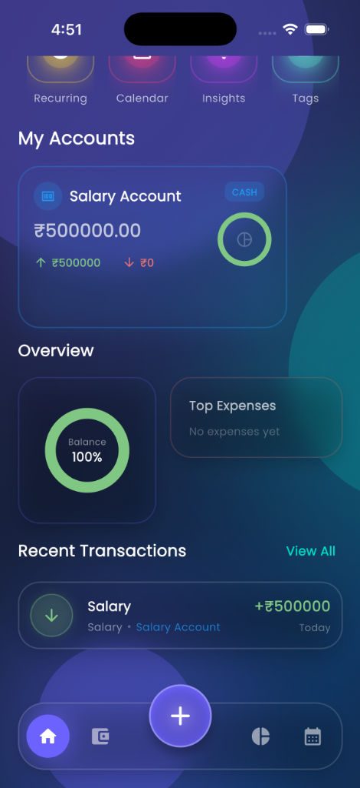
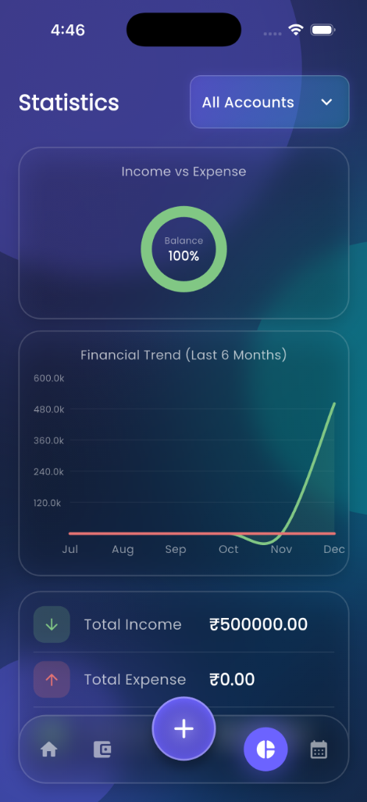
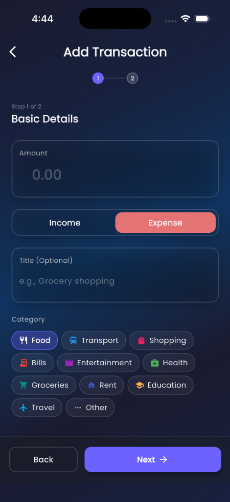
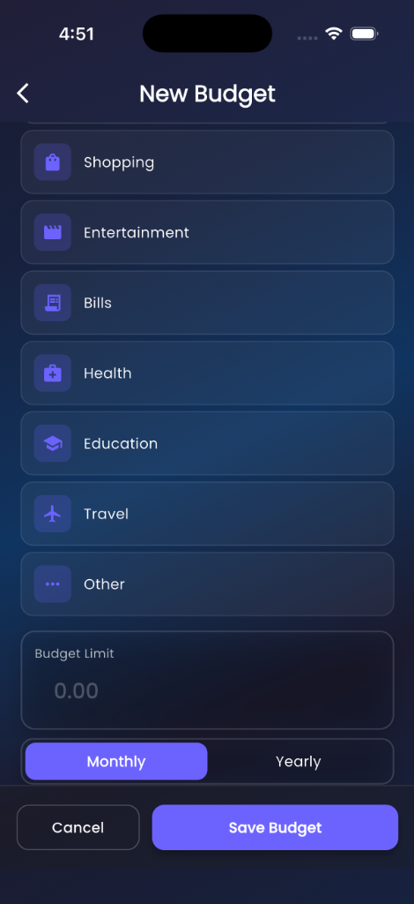
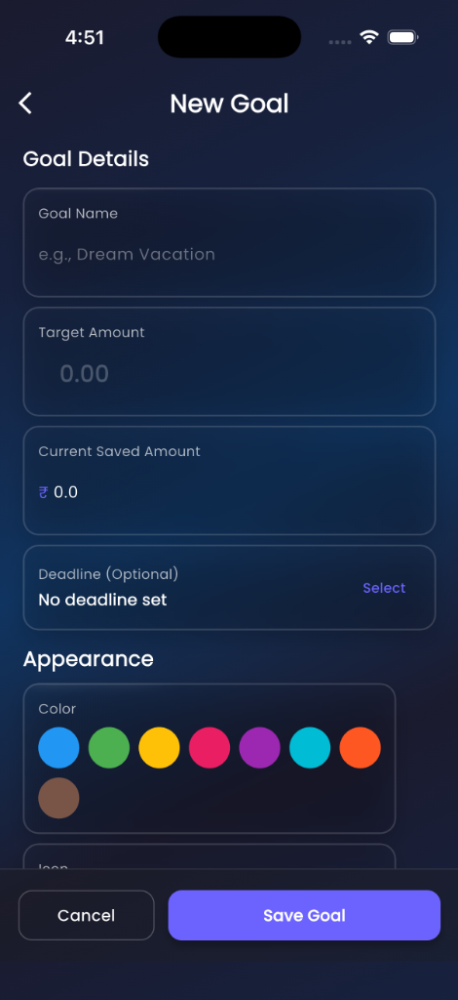
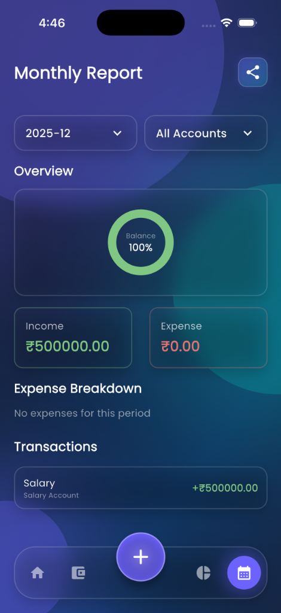
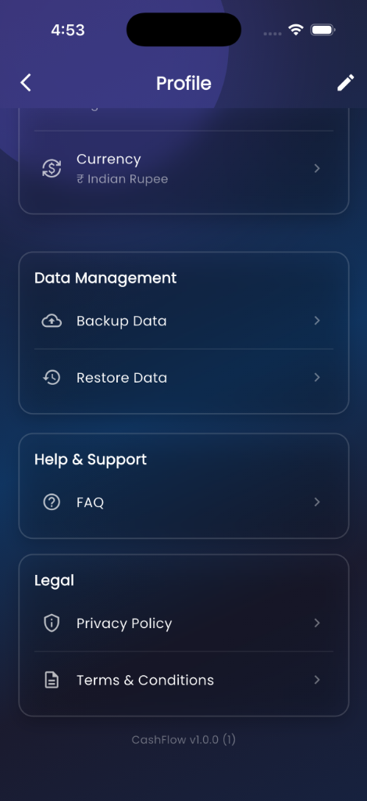
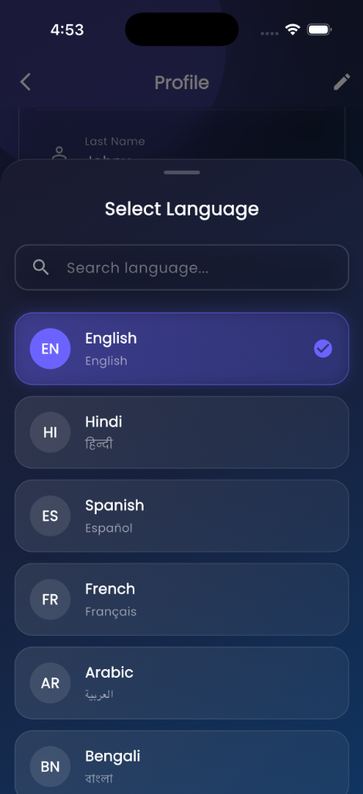

# CashFlow - Personal Finance Manager


**CashFlow** is a modern, privacy-focused personal finance application built with Flutter. It helps you track your income, expenses, and net worth with a beautiful "liquid" glassmorphism design. Your data stays secure on your device with robust encryption and local-first storage.

---

## ✨ Key Features

- **💰 Comprehensive Tracking**: Manage multiple accounts (Cash, Bank, Wallet, Credit Cards, Loans) in one place.
- **📊 Visual Analytics**: Interactive charts and graphs for income vs. expense analysis and category breakdowns.
- **🔒 Advanced Security**:
  - **App Lock**: Secure your data with a PIN.
  - **Biometrics**: FaceID and Fingerprint unlock support.
  - **Auto-Lock**: Immediate privacy protection when switching apps.
- **💾 Data Management**:
  - **Backup & Restore**: Export your data to JSON and restore it anytime.
  - **Offline First**: Full functionality without an internet connection.
- **🌍 Localization**: Support for multiple languages (English, Arabic, Hindi, Spanish, etc.) with RTL layout support.
- **📝 Smart Transactions**: Recurring transactions, custom categories, and tag-based organization.
- **📄 Professional Reports**: Generate and share detailed monthly PDF reports.
- **🎨 Premium UI**: Dark mode, glassmorphism effects, and smooth animations.

---

## 📸 Screenshots

<p align="center">
  
  
  
  
</p>

<p align="center">
  <b>Dashboard • Accounts • Statistics • Insights</b>
</p>

<br>

<p align="center">
  
  
  
  
</p>

<p align="center">
  <b>Add Transaction • Budgets • Goals • PDF Reports</b>
</p>

<br>

<p align="center">
  
  
  
  
</p>

<p align="center">
  <b>Security • Backup/Restore • Localization • Login</b>
</p>

---

## 🛠️ Tech Stack

- **Framework**: [Flutter](https://flutter.dev/)
- **Language**: [Dart](https://dart.dev/)
- **State Management**: [Provider](https://pub.dev/packages/provider)
- **Local Database**: [Sqflite](https://pub.dev/packages/sqflite)
- **Security**: [flutter_secure_storage](https://pub.dev/packages/flutter_secure_storage) & [local_auth](https://pub.dev/packages/local_auth)
- **Charts**: [FL Chart](https://pub.dev/packages/fl_chart)
- **PDF Generation**: [pdf](https://pub.dev/packages/pdf) & [printing](https://pub.dev/packages/printing)

---

## 🚀 Getting Started

### Prerequisites

- Flutter SDK (3.0.0 or higher)
- Dart SDK
- Android Studio / VS Code

### Installation

1. **Clone the repository**
   ```bash
   git clone https://github.com/yourusername/cashflow_app.git
   cd cashflow_app
   ```

2. **Install dependencies**
   ```bash
   flutter pub get
   ```

3. **Run the app**
   ```bash
   flutter run
   ```

---

## 🤝 Contributing

Contributions are welcome! Please feel free to submit a Pull Request.

1. Fork the project
2. Create your feature branch (`git checkout -b feature/AmazingFeature`)
3. Commit your changes (`git commit -m 'Add some AmazingFeature'`)
4. Push to the branch (`git push origin feature/AmazingFeature`)
5. Open a Pull Request

---

## 📄 License

This project is licensed under the MIT License - see the [LICENSE](LICENSE) file for details.

---

<p align="center">
  Built with ❤️ using Flutter
</p>
