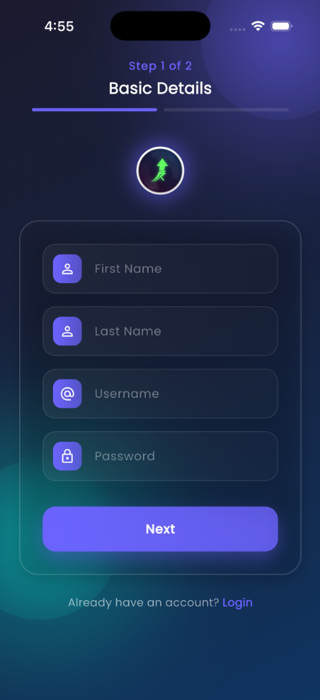
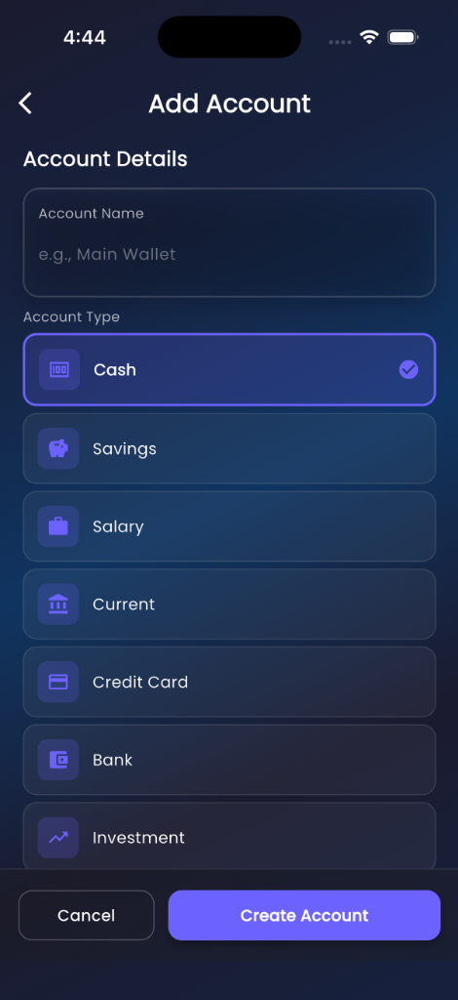
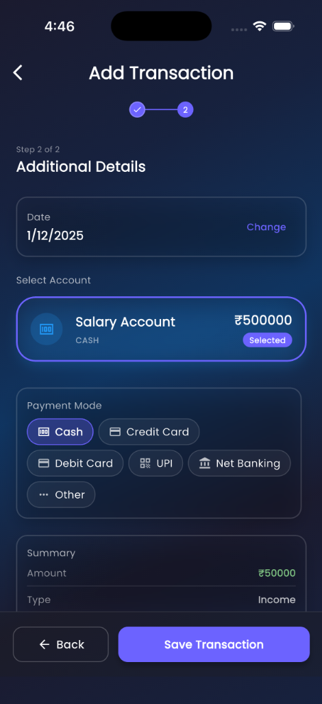

# CashFlow App - User Manual

**Version:** 1.0.0  
**Platform:** Android & iOS  
**Last Updated:** November 2025

---

## Table of Contents

1. [Getting Started](#getting-started)
2. [User Account](#user-account)
3. [Managing Accounts](#managing-accounts)
4. [Recording Transactions](#recording-transactions)
5. [Budgets](#budgets)
6. [Financial Goals](#financial-goals)
7. [Recurring Transactions](#recurring-transactions)
8. [Reports & Analytics](#reports--analytics)
9. [Notifications](#notifications)
10. [Settings & Profile](#settings--profile)
11. [Tips & Best Practices](#tips--best-practices)
12. [Troubleshooting](#troubleshooting)
13. [FAQ](#faq)

---

## 1. Getting Started

### 1.1 Installation

**Android:**
1. Download the APK file
2. Enable "Install from Unknown Sources" in Settings
3. Tap the APK file to install
4. Open the CashFlow app

**iOS:**
1. Download from TestFlight or App Store
2. Install the application
3. Open the CashFlow app

### 1.2 First Launch

When you first open CashFlow, you'll see:

1. **Welcome Screen:** Introduction to the app features
2. **Sign Up:** Create your account
2. **Sign Up:** Create your account
3. **Dashboard:** Your financial overview

### 1.3 Creating Your Account

**Step-by-Step:**

1. Tap **"Sign Up"** on the welcome screen
2. Fill in your details:
   - **First Name:** Your first name
   - **Last Name:** Your last name
   - **Username:** Choose a unique username (for login)
   - **Password:** Create a secure password
   - **Currency:** Select your preferred currency symbol (₹, $, €, £, etc.)
3. Tap **"Sign Up"**
4. You'll be automatically logged in

> **💡 Tip:** Choose a username you'll remember easily!

---

## 2. User Account

### 2.1 Logging In

1. Open the app
2. Enter your **username** and **password**
3. Tap **"Login"**

> **Note:** The app will remember your login for future sessions.

### 2.2 Logging Out

1. Go to **Profile** (bottom navigation)
2. Scroll down
3. Tap **"Logout"**

---

## 3. Managing Accounts

Accounts represent where your money is stored (bank accounts, cash, credit cards, etc.).

### 3.1 Viewing Accounts

1. Tap **"Accounts"** from the dashboard or bottom navigation
2. See all your accounts with:
   - Account name
   - Account type
   - Current balance
   - Bank name (if applicable)

### 3.2 Adding an Account

**Step-by-Step:**

1. Go to **Accounts** screen
2. Tap the **"+"** button
3. Select **Account Type:**
   - Cash
   - Savings Account
   - Salary Account
   - Current Account
   - Credit Card
   - Bank Account
   - Investment
   - Loan
   - Other

4. Fill in the details based on account type:

**For Cash/Other:**
- Account name
- Initial balance
- Choose color and icon

**For Bank Accounts (Savings/Salary/Current):**
- Account name
- Bank name
- Account number
- Initial balance
- Choose color and icon

**For Credit Card:**
- Card name
- Bank name
- Last 4 digits of card number
- Credit limit
- Current outstanding balance
- Choose color and icon

**For Loan:**
- Loan name
- Bank/Lender name
- Loan amount (principal)
- Interest rate (annual %)
- Loan tenure (months)
- Loan start date
- EMI payment day (1-31)
- Choose color and icon

5. Tap **"Add Account"**

> **💡 Tip:** Use different colors for different account types to easily identify them!

### 3.3 Editing an Account

1. Go to **Accounts** screen
2. Tap on the account you want to edit
3. Modify the details
4. Tap **"Save Changes"**

### 3.4 Deleting an Account

1. Go to **Accounts** screen
2. Tap on the account
3. Tap **"Delete Account"**
4. Confirm deletion

> **⚠️ Warning:** Deleting an account will also delete all associated transactions!

### 3.5 Understanding Loan Accounts

**Loan Account Features:**

- **EMI Calculation:** Automatically calculated based on principal, rate, and tenure
- **EMI Tracking:** Track how many EMIs you've paid
- **Remaining Balance:** See how much loan is left
- **Interest Paid:** View total interest paid so far
- **EMI Reminders:** Get notifications 2 days before EMI due date

**Paying an EMI:**
1. When you pay an EMI, record it as an expense transaction
2. Go to the loan account details
3. The app will track your EMI payments

---

## 4. Recording Transactions

Transactions are your income and expenses.

### 4.1 Adding a Transaction (Quick Method)

1. Tap the **"+"** floating button on the dashboard
2. Fill in:
   - **Title:** Description (e.g., "Grocery Shopping")
   - **Amount:** Transaction amount
   - **Type:** Income or Expense
   - **Category:** Select appropriate category
   - **Account:** Choose which account
   - **Date:** Transaction date
   - **Tags:** (Optional) Add tags
3. Tap **"Add Transaction"**

### 4.2 Adding a Transaction (Multi-Step Method)

For a more guided experience:

1. Tap **"Add Transaction"** from the menu
2. **Step 1 - Basic Info:**
   - Enter title and amount
   - Select income or expense
3. **Step 2 - Category & Tags:**
   - Choose category
   - Add tags (optional)
4. **Step 3 - Account & Date:**
   - Select account
   - Choose date
5. Review and tap **"Add Transaction"**

### 4.3 Transaction Categories

**Income Categories:**
- Salary
- Business
- Investments
- Gifts
- Other

**Expense Categories:**
- Food & Dining
- Transportation
- Shopping
- Bills & Utilities
- Entertainment
- Healthcare
- Education
- Other

### 4.4 Using Tags

Tags help you organize transactions beyond categories.

**Examples:**
- "Work" for work-related expenses
- "Vacation" for holiday spending
- "Emergency" for unexpected costs
- "Tax-deductible" for tax purposes

**To Add Tags:**
1. Go to **Tags Management** from the menu
2. Tap **"+"**
3. Enter tag name and choose color
4. Use tags when adding transactions

### 4.5 Viewing Transactions

1. Tap **"Transactions"** from the dashboard
2. See all transactions with:
   - Date
   - Title
   - Amount (green for income, red for expense)
   - Category
   - Account

**Filtering:**
- Filter by account
- Filter by category
- Filter by tags
- Filter by date range
- Search by title

### 4.6 Editing a Transaction

1. Go to **Transactions**
2. Tap on the transaction
3. Modify details
4. Tap **"Save"**

### 4.7 Deleting a Transaction

1. Go to **Transactions**
2. Tap on the transaction
3. Tap **"Delete"**
4. Confirm deletion

> **Note:** Deleting a transaction will update the account balance automatically.

---

## 5. Budgets

Budgets help you control spending by setting limits for each category.

### 5.1 Creating a Budget

1. Go to **Budgets** from the dashboard
2. Tap **"+"**
3. Fill in:
   - **Category:** Choose expense category
   - **Amount:** Budget limit
   - **Period:** Monthly or Yearly
   - **Start Date:** When the budget begins
4. Tap **"Add Budget"**

### 5.2 Tracking Budget Progress

1. Go to **Budgets**
2. See each budget with:
   - Category name
   - Budget amount
   - Amount spent
   - Progress bar
   - Percentage used

**Color Indicators:**
- **Green:** Under budget (< 80%)
- **Yellow:** Approaching limit (80-100%)
- **Red:** Over budget (> 100%)

### 5.3 Editing a Budget

1. Go to **Budgets**
2. Tap on the budget
3. Modify details
4. Tap **"Save"**

### 5.4 Deleting a Budget

1. Go to **Budgets**
2. Tap on the budget
3. Tap **"Delete"**
4. Confirm deletion

> **💡 Tip:** Set realistic budgets based on your past spending patterns!

---

## 6. Financial Goals

Goals help you save for specific objectives.

### 6.1 Creating a Goal

1. Go to **Goals** from the dashboard
2. Tap **"+"**
3. Fill in:
   - **Goal Name:** (e.g., "New Car", "Vacation")
   - **Target Amount:** How much you need
   - **Current Amount:** How much you've saved
   - **Deadline:** (Optional) Target date
   - **Icon:** Choose an icon
   - **Color:** Choose a color
4. Tap **"Add Goal"**

### 6.2 Updating Goal Progress

1. Go to **Goals**
2. Tap on the goal
3. Update **Current Amount**
4. Tap **"Save"**

### 6.3 Viewing Goal Progress

Each goal shows:
- Goal name and icon
- Target amount
- Current amount
- Progress bar
- Percentage completed
- Days remaining (if deadline set)

### 6.4 Editing a Goal

1. Go to **Goals**
2. Tap on the goal
3. Modify details
4. Tap **"Save"**

### 6.5 Deleting a Goal

1. Go to **Goals**
2. Tap on the goal
3. Tap **"Delete"**
4. Confirm deletion

> **💡 Tip:** Link your savings transactions to goals by using tags!

---

## 7. Recurring Transactions

Automate regular income or expenses.

### 7.1 Creating a Recurring Transaction

1. Go to **Recurring Transactions** from the menu
2. Tap **"+"**
3. Fill in:
   - **Title:** Description
   - **Amount:** Transaction amount
   - **Type:** Income or Expense
   - **Category:** Select category
   - **Frequency:** Daily, Weekly, Monthly, or Yearly
   - **Next Due Date:** When it should occur next
   - **Auto-Add:** Enable to automatically create transactions
   - **Account:** Select account
4. Tap **"Add"**

### 7.2 Frequency Options

- **Daily:** Every day
- **Weekly:** Every 7 days
- **Monthly:** Same date each month
- **Yearly:** Same date each year

### 7.3 Auto-Add Feature

When **Auto-Add** is enabled:
- The app automatically creates a transaction on the due date
- The next due date is updated automatically
- You'll see the transaction in your transaction list

When **Auto-Add** is disabled:
- You'll get a reminder
- You need to manually add the transaction

### 7.4 Editing a Recurring Transaction

1. Go to **Recurring Transactions**
2. Tap on the item
3. Modify details
4. Tap **"Save"**

### 7.5 Deleting a Recurring Transaction

1. Go to **Recurring Transactions**
2. Tap on the item
3. Tap **"Delete"**
4. Confirm deletion

> **💡 Tip:** Use recurring transactions for rent, subscriptions, salary, etc.

---

## 8. Reports & Analytics

### 8.1 Dashboard Overview

The dashboard shows:

**Net Worth Section:**
- Total balance across all accounts
- Bar chart showing daily/weekly/monthly/yearly trends
- Toggle to hide/show for privacy

**Income vs. Expense:**
- Current month comparison
- Pie chart visualization
- Percentage breakdown

**Recent Transactions:**
- Last 5 transactions
- Quick overview

**Quick Access Cards:**
- Navigate to different features

### 8.2 Statistics Screen

1. Go to **Stats** from the dashboard
2. View:
   - **Account Breakdown:** Income and expense per account
   - **Financial Trends:** Line chart showing trends over time
   - **Category Analysis:** Pie chart of expense distribution
   - **Top Categories:** Highest spending categories

**Filtering:**
- Select specific account
- Choose date range
- View income or expense

### 8.3 Monthly Reports

1. Go to **Monthly Report** from the dashboard
2. Select month and year
3. View:
   - Total income
   - Total expenses
   - Net savings
   - Category breakdown
   - Account-wise analysis
   - All transactions for the month

### 8.4 Generating PDF Reports

1. Go to **Monthly Report**
2. Select the month
3. Tap **"Generate PDF"** or **"Share Report"**
4. The PDF includes:
   - App branding
   - Summary cards
   - Category breakdown with charts
   - Detailed transaction table
5. Share via email, messaging, or save to device

### 8.5 Calendar View

1. Go to **Calendar** from the menu
2. View transactions by date
3. Tap on a date to see transactions
4. Add transactions directly from calendar

> **💡 Tip:** Generate monthly reports for tax purposes or expense tracking!

---

## 9. Notifications

### 9.1 Notification Types

**EMI Reminders:**
- Sent 2 days before EMI due date
- Shows loan name and amount
- Helps you prepare for payment

**Budget Alerts:**
- When you exceed a budget
- When approaching budget limit

**Goal Reminders:**
- When deadline is approaching
- When goal is achieved

### 9.2 Viewing Notifications

1. Tap **Notifications** from the menu
2. See all notifications
3. Tap to mark as read
4. Swipe to delete

### 9.3 Notification Settings

1. Go to **Profile**
2. Tap **"Notification Settings"**
3. Enable/disable notification types
4. Set notification preferences

> **Note:** You need to grant notification permission when first prompted.

### 9.4 App Lock & Security

1. Go to **Profile**
2. Tap **"Security"**
3. **App Lock:** Toggle to enable and set a 4-digit PIN
4. **Biometrics:** Toggle to enable FaceID or Fingerprint unlock
5. **Change PIN:** Update your existing PIN

---

## 10. Settings & Profile

### 10.1 Viewing Profile

1. Tap **Profile** from bottom navigation
2. See your:
   - Name
   - Username
   - Currency preference
   - App version

### 10.2 Editing Profile

1. Go to **Profile**
2. Tap **"Edit Profile"**
3. Update:
   - First Name
   - Last Name
   - Password
   - Currency Symbol
4. Tap **"Save Changes"**

### 10.3 Changing Currency

1. Go to **Profile**
2. Tap **"Edit Profile"**
3. Select new currency symbol
4. Tap **"Save"**

> **Note:** Changing currency only affects the display symbol, not the values.

### 10.4 Data Management (Backup & Restore)

**Backup Data:**
1. Go to **Profile**
2. Tap **"Backup Data"**
3. Choose a location to save the backup file (`.json`)
4. Keep this file safe!

**Restore Data:**
1. Go to **Profile**
2. Tap **"Restore Data"**
3. Select your backup file
4. Confirm restoration (Current data will be replaced)

### 10.5 Language Settings

1. Go to **Profile**
2. Tap the **Language** icon (top right or in menu)
3. Select your preferred language
4. The app updates immediately

### 10.4 Resetting Data

**⚠️ Warning:** This will delete ALL your data!

1. Go to **Profile**
2. Scroll down
3. Tap **"Reset All Data"**
4. Confirm deletion
5. You'll be logged out
6. All accounts, transactions, budgets, and goals will be deleted

### 10.5 App Information

1. Go to **Profile**
2. View:
   - App version
   - Privacy Policy
   - Terms & Conditions
   - FAQ

---

## 11. Tips & Best Practices

### 11.1 Getting Started Tips

1. **Start Simple:** Begin with one or two accounts
2. **Record Daily:** Add transactions as they happen
3. **Use Categories:** Properly categorize for better insights
4. **Set Budgets:** Start with major expense categories
5. **Review Weekly:** Check your dashboard weekly

### 11.2 Account Management

1. **Color Code:** Use different colors for different account types
2. **Regular Updates:** Update balances if they drift
3. **Loan Tracking:** Always record EMI payments
4. **Credit Cards:** Track as negative balances

### 11.3 Transaction Recording

1. **Be Descriptive:** Use clear titles
2. **Immediate Entry:** Record transactions right away
3. **Use Tags:** Tag transactions for better organization
4. **Check Receipts:** Verify amounts before entering

### 11.4 Budgeting

1. **Realistic Limits:** Set achievable budget limits
2. **Monthly Review:** Review and adjust budgets monthly
3. **Priority Categories:** Budget for essentials first
4. **Track Progress:** Check budget status regularly

### 11.5 Goal Setting

1. **Specific Goals:** Define clear, specific goals
2. **Realistic Targets:** Set achievable target amounts
3. **Deadlines:** Use deadlines for motivation
4. **Regular Updates:** Update progress frequently
5. **Celebrate:** Acknowledge when you achieve goals

### 11.6 Data Security

1. **Strong Password:** Use a secure password
2. **Regular Backups:** Export PDF reports regularly
3. **Privacy:** Use the hide net worth feature in public
4. **Logout:** Logout on shared devices

---

## 12. Troubleshooting

### 12.1 Login Issues

**Problem:** Can't log in

**Solutions:**
1. Check username and password spelling
2. Ensure caps lock is off
3. Try resetting the app data (last resort)

### 12.2 Balance Discrepancies

**Problem:** Account balance doesn't match

**Solutions:**
1. Check all transactions for the account
2. Look for duplicate entries
3. Verify transaction amounts
4. Edit account balance if needed

### 12.3 Notifications Not Working

**Problem:** Not receiving notifications

**Solutions:**
1. Check app notification permissions
2. Enable notifications in device settings
3. Check notification settings in app
4. Restart the app

### 12.4 PDF Generation Fails

**Problem:** Can't generate PDF report

**Solutions:**
1. Check storage permissions
2. Ensure enough storage space
3. Try a different month
4. Restart the app

### 12.5 App Crashes

**Problem:** App keeps crashing

**Solutions:**
1. Restart your device
2. Clear app cache
3. Reinstall the app
4. Check for updates

### 12.6 Widget Not Updating

**Problem:** Home screen widget shows old data

**Solutions:**
1. Add a new transaction to trigger update
2. Remove and re-add widget
3. Restart device

---

## 13. FAQ

### General Questions

**Q: Is my data safe?**  
A: Yes, all data is stored locally on your device. The app does not send data to any servers.

**Q: Can I use the app offline?**  
A: Yes, CashFlow works completely offline.

**Q: Can I sync across devices?**  
A: Currently, no. Each device has its own local database.

**Q: How do I backup my data?**  
A: Export monthly PDF reports. Full backup feature coming soon.

### Account Questions

**Q: How many accounts can I create?**  
A: Unlimited accounts.

**Q: Can I transfer money between accounts?**  
A: Yes, create an expense in one account and income in another.

**Q: What if I delete an account by mistake?**  
A: Deleted accounts cannot be recovered. All associated transactions are also deleted.

### Transaction Questions

**Q: Can I edit past transactions?**  
A: Yes, tap on any transaction to edit it.

**Q: How do I split a transaction?**  
A: Create separate transactions for each split amount.

**Q: Can I attach receipts?**  
A: Not currently. This feature is planned for future updates.

### Budget Questions

**Q: Can I have multiple budgets for the same category?**  
A: No, one budget per category per period.

**Q: What happens when I exceed a budget?**  
A: You'll get a notification, but you can still add transactions.

**Q: Can I set weekly budgets?**  
A: Currently only monthly and yearly budgets are supported.

### Goal Questions

**Q: Can I link transactions to goals?**  
A: Use tags to track goal-related transactions.

**Q: What happens when I reach a goal?**  
A: You'll get a notification. You can then delete or update the goal.

### Report Questions

**Q: Can I export data to Excel?**  
A: Currently only PDF export is available.

**Q: Can I customize report date ranges?**  
A: Monthly reports are fixed to calendar months.

### Technical Questions

**Q: Which platforms are supported?**  
A: Android and iOS.

**Q: What's the minimum Android version?**  
A: Android 5.0 (API 21) and above.

**Q: What's the minimum iOS version?**  
A: iOS 12.0 and above.

**Q: How much storage does the app use?**  
A: Minimal - typically under 50MB including data.

---

## Need More Help?

### In-App Help

1. Go to **Profile**
2. Tap **"FAQ"**
3. Search for your question

### Contact Support

For additional support or feature requests, please contact the development team through the app store or official channels.

---

## Quick Reference

### Common Tasks

| Task | Steps |
|------|-------|
| Add Transaction | Dashboard → + button → Fill form → Save |
| Create Budget | Budgets → + → Fill details → Save |
| Set Goal | Goals → + → Fill details → Save |
| View Report | Dashboard → Monthly Report → Select month |
| Export PDF | Monthly Report → Share Report |
| Add Account | Accounts → + → Select type → Fill details |
| Edit Profile | Profile → Edit Profile → Update → Save |

### Navigation

| Screen | How to Access |
|--------|---------------|
| Dashboard | Bottom navigation - Home icon |
| Accounts | Bottom navigation - Accounts icon |
| Transactions | Dashboard → Transactions card |
| Stats | Dashboard → Stats card |
| Profile | Bottom navigation - Profile icon |
| Budgets | Dashboard → Budgets card |
| Goals | Dashboard → Goals card |

---

**Thank you for using CashFlow!**

We hope this app helps you achieve your financial goals. Happy budgeting! 💰

---

**Version:** 1.0.0  
**Last Updated:** November 2025  
**© 2025 CashFlow App**
